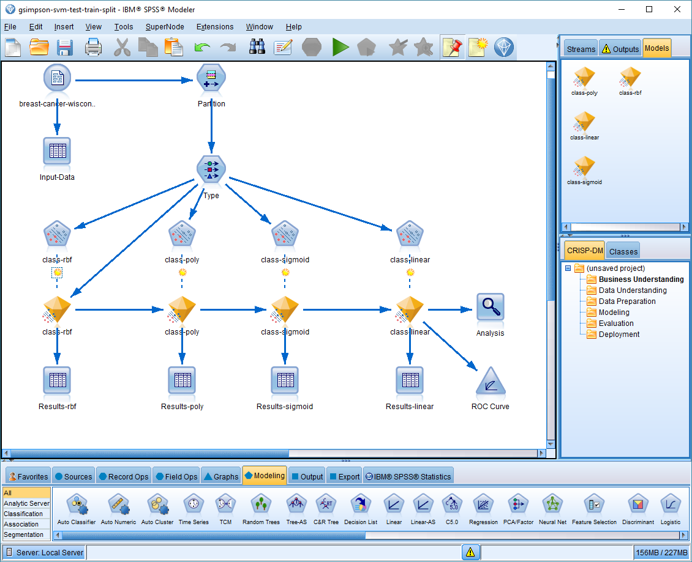
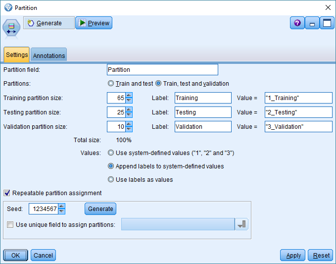
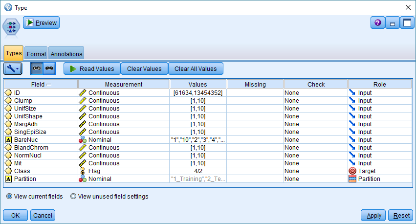
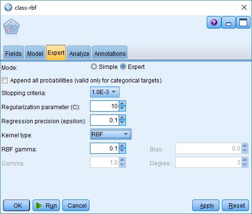
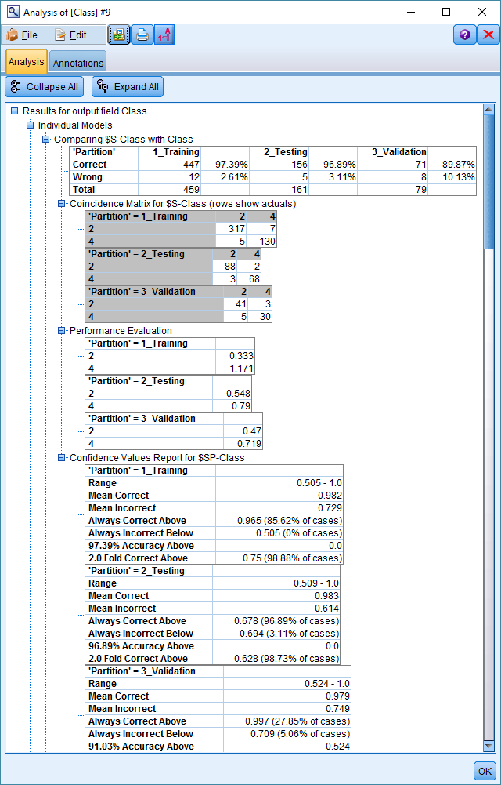
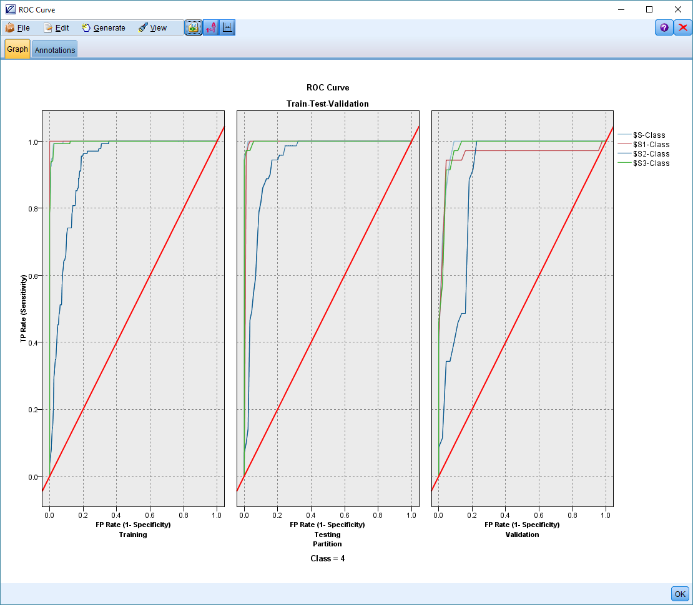

# IBM Watson Tool Exploration

After my experience with Galvanize, I will be joining Truven Health Analytics. 
http://truvenhealth.com/

Truven has recently been acquired by IBM and is in the process of being integrated into the IBM Watson Health group. https://www.ibm.com/watson/health/

I chose a topic that would allow me to combine these areas:
1. Health Care Domain
2. Data Science
3. IBM Watson Tools

## Table of Contents
1. Health Care Dataset
    * Breast Cancer Study - Univ of Wisconsin
2. Data Science
    * SVM (Support Vector Machines)
3. IBM Watson Tools
    * SPSS
4. Future
    * Improved Display and Dashboard Functions

---
# Health Care DataSet
<a href="http://cml.ics.uci.edu">

<b>Center for Machine Learning and Intelligent Systems</b> 
<b>Breast Cancer Wisconsin (Original) Data Set</b>

Publicly available here:
http://archive.ics.uci.edu/ml/datasets/Breast+Cancer+Wisconsin+%28Original%29
http://archive.ics.uci.edu/ml/machine-learning-databases/breast-cancer-wisconsin/breast-cancer-wisconsin.data

My example uses a dataset that is publicly available from the UCI Machine Learning Repository
I modified the data set to include column titles.
The dataset consists of about 700 human cell sample records, each of which contains the values of a set of cell characteristics. 
The fields in each record are:

|Field name|Description|
|:--------:|:---------:|
|ID	|Patient identifier|
|Clump|	Clump thickness|
|UnifSize|	Uniformity of cell size|
|UnifShape|	Uniformity of cell shape|
|MargAdh|	Marginal adhesion|
|SingEpiSize|	Single epithelial cell size|
|BareNuc|	Bare nuclei|
|BlandChrom|	Bland chromatin|
|NormNucl|	Normal nucleoli|
|Mit|	Mitoses|
|Class|	Benign or malignant|

This dataset that has a relatively small number of predictors in each record.

# Support Vector Machines

## Theory
[Wikipedia - Support Vector Machine](https://en.wikipedia.org/wiki/Support_vector_machine) 

An SVM model is a representation of the examples as points in space, mapped so that the examples of the separate categories are divided by a clear gap that is as wide as possible. New examples are then mapped into that same space and predicted to belong to a category based on which side of the gap they fall on.
In addition to performing linear classification, SVMs can efficiently perform a non-linear classification using what is called the kernel trick, implicitly mapping their inputs into high-dimensional feature spaces.

### Hyperplanes
[IBM SPSS - SVM Hyperplanes](https://www.ibm.com/support/knowledgecenter/SS3RA7_15.0.0/com.ibm.spss.modeler.help/svm_howwork.htm)
SVM works by mapping data to a high-dimensional feature space so that data points can be categorized, even when the data are not otherwise linearly separable. A separator between the categories is found, then the data are transformed in such a way that the separator could be drawn as a hyperplane. Following this, characteristics of new data can be used to predict the group to which a new record should belong.

### Kernel Function
[IBM SPSS - SVM Kernel Function](https://www.ibm.com/support/knowledgecenter/SS3RA7_15.0.0/com.ibm.spss.modeler.help/svm_howwork.htm)
The mathematical function used for the transformation is known as the kernel function. SVM in IBM® SPSS® Modeler supports the following kernel types:

In the IBM SPSS Modeling tool, I was able to run each of the available kernels side by side to compare the results.
They each use different algorithms and parameters.

• Linear
A linear kernel function is recommended when linear separation of the data is straightforward. 
In other cases, one of the other functions should be used. 
https://www.ibm.com/support/knowledgecenter/SS3RA7_15.0.0/com.ibm.spss.modeler.help/svm_howwork.htm

• Polynomial
the polynomial kernel looks not only at the given features of input samples to determine their similarity, but also combinations of these.
https://en.wikipedia.org/wiki/Polynomial_kernel

• Radial basis function (RBF)
C and Gamma are the parameters for a nonlinear support vector machine (SVM) with a Gaussian radial basis function kernel.
that allows some examples to be "ignored" or placed on the wrong side of the margin
http://scikit-learn.org/stable/auto_examples/svm/plot_rbf_parameters.html

• Sigmoid
The Sigmoid Kernel comes from the Neural Networks field, where the bipolar sigmoid function is often used as an activation function for artificial neurons.
http://crsouza.com/2010/03/17/kernel-functions-for-machine-learning-applications/

# SPSS Modeler

I explored the IBM SPSS Modeling tool.
https://www.ibm.com/support/knowledgecenter/SS3RA7_18.0.0/modeler_mainhelp_client_ddita/clementine/entities/clem_family_overview.html

This tool makes fast and easy work of Exploratory Data Analysis (EDA), Modeling and Presentation.
It is icon based and easily configurable within each icon.

The software name originally stood for Statistical Package for the Social Sciences (SPSS),
reflecting the original market, although the software is now popular in other fields as 
well, including the health sciences and marketing.
(https://en.wikipedia.org/wiki/SPSS)

The complete stream of my model is:

The main processes( which do not present themselves very clearly) are:
* data ingestion and manipulation
* model processing
* results analysis

The data manipulation phase is covered by the nodes labeled

* "Breast-cancer-wisconsin"
** loads the raw data and performs any required processing 
* Partition
** separates the data into train (65%) test (25%) and validation (10%) data sets

The Type icon allows you to define or ignore input and target output fields.

The kernels that are available are modeled in serial alignment.
This allows them to append their results to the previous results for later comparison.
Each SVM instance in this stream implements a different kernel.

Here is the configuration for the Radial Basis Function (rbf) kernel

The results are all compared against the included correct result as well as against each other to gauge performance.

And a ROC curve can be generated to visually see the correctness of the model.

    
    

---
## References

(https://www.ibm.com/support/knowledgecenter/en/SS3RA7_18.0.0/modeler_tutorial_ddita/clementine/entities/examples_intro.html) Demo list

(http://www.ibm.com/support/knowledgecenter/SS3RA7_17.0.0/modeler_tutorial_ddita-gentopic1.html)
(http://www.ibm.com/support/knowledgecenter/en/SS3RA7_17.0.0/clementine/example_adp.html)
(http://www.ibm.com/support/knowledgecenter/en/SS3RA7_17.0.0/clementine/example_svm_intro.html)
(https://en.wikipedia.org/wiki/Support_vector_machine)
https://www.ibm.com/support/knowledgecenter/SS3RA7_15.0.0/com.ibm.spss.modeler.help/svm_howwork.htm

kernel research links
https://www.quora.com/What-are-C-and-gamma-with-regards-to-a-support-vector-machine
http://scikit-learn.org/stable/modules/generated/sklearn.svm.SVC.html
http://stats.stackexchange.com/questions/168014/where-can-i-read-about-gamma-coefficient-in-svm-in-scikit-learn

